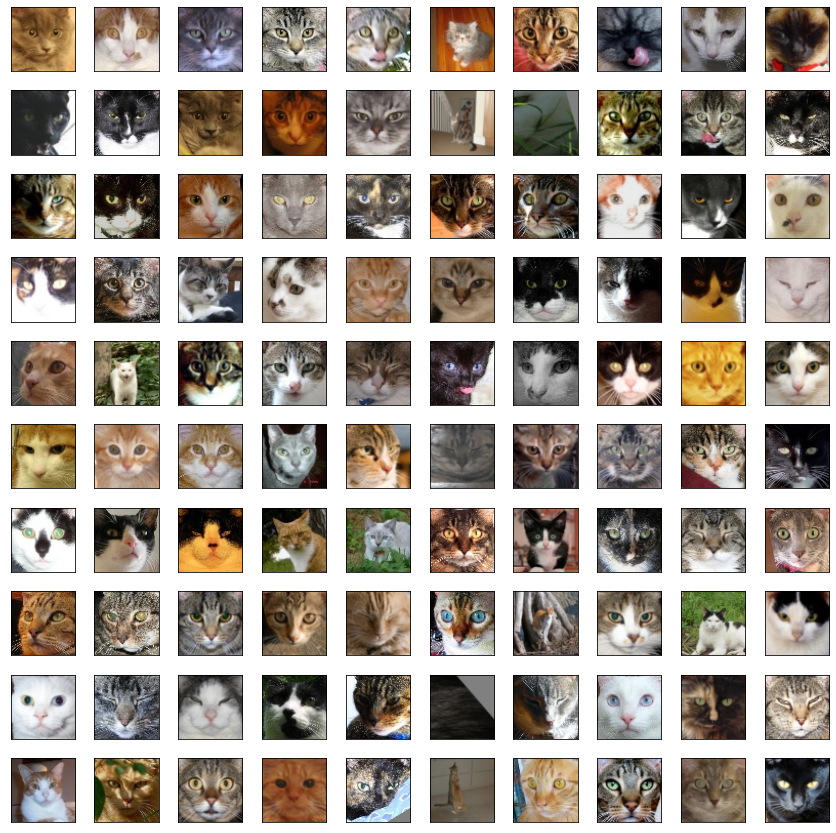

`

# GeneratingCats
CAS ADS M3 Project Submission by Petra Müller, University Bern.
The goal of this project was to create and train a Generative Adversarial Network to generate realistic looking cat faces.


## Getting started

To train a GAN yourself or to run this example, it is highly recommended to run it in an environment like [Google Colab](https://colab.research.google.com) for performance reasons. 
For the sake of this project, data preprocessing, model definitions as well as the model training itself is presented in a single [Jupyter Notebook](https://github.com/pmuellerCAS/GeneratingCats/blob/code/Mueller_generating_cats.ipynb). 

### Prerequisites
The following **libraries** are required to run the provided Jupyter Notebook:
```
import numpy as np 
import pandas as pd 
import matplotlib.pyplot as plt
import os
import glob
import math
import random
import time
import datetime
import shutil
from tqdm import tqdm, tqdm_notebook

from pathlib import Path
import warnings

from PIL import Image

import tensorflow as tf
from tensorflow.keras.initializers import RandomNormal
from tensorflow.keras import Sequential
from tensorflow.keras.layers import Dense, BatchNormalization, LeakyReLU, Reshape, Conv2DTranspose, Conv2D, Flatten, Dropout, Embedding, ReLU
```
Additionally, **if running on Google Colab**, make sure Tensorflow version 2.x is selected by specifying Tensorflow version like this:
```
%tensorflow_version 2.x 
```
### Generative Adversarial Networks (GANs)
GANs were introduced by [Ian J. Goodfellow and co-authors in 2014](https://arxiv.org/abs/1406.2661). These networks
consist of two neural networks - a generator and a discriminator - which compete with
each other in a ’game’ (thus the “adversarial”):


To further understand how GAN's operate, I recommend reading [A Gentle Introduction to Generative Adversarial Networks (GANs)](https://machinelearningmastery.com/what-are-generative-adversarial-networks-gans/) by J. Brownlee on machinelearningmastery.com or [Generative Adversarial Networks for beginners](https://www.oreilly.com/content/generative-adversarial-networks-for-beginners/) by J. Bruner and A. Deshpande on oreilly.com. 

For further information about how to implement GAN's in Tensorflow and Python, please take a look at the [tutorial](https://www.tensorflow.org/tutorials/generative/dcgan) provided by Tensorflow. This project is heavily based on this tutorial. 

To further understand how my cat generator GAN was built, you may consult [my presentation](https://github.com/pmuellerCAS/GeneratingCats/blob/readme/MUELLER_GeneratingCats.pdf) of the project.

## Usage

There are many ways to use this project for your own purposes. In the following section, some recommendations and hints are given depending on selected use-cases. 

### Running this example exactly like I did:

**Training data** for this GAN project was obtained from [GitHub user Federico Ferlito (Ferlix)](https://github.com/Ferlix/Cat-faces-dataset). The dataset contains a collection of 29843 images of cat faces of size 64x64. 

`

If you want to use this dataset, I recommend downloading the [numpy binary file](https://github.com/pmuellerCAS/GeneratingCats/blob/master/training_data_64_64.npy) provided in this repository and then - if you are running the Jupyter Notebook on Google Colab - upload the file to your Google Drive and synchronise it with Colab. Adjust the path to the training data file in your copy of the Notebook accordingly. 

```
# load the binary file
allcats = np.load('/your/path/to/data/input/training_data_64_64.npy')
```
Then simply follow the steps provided in the Notebook to run the training process. 

### Training this GAN with your own training data:

This GAN is in it's current state optimised and built to be trained on images of size 64x64x3. If your input data has a different shape, adjustments need to be made to the code accordingly. 
It is recommended to store the training data in a numpy array binary file as this file format is more sparse and combines all the training images into 1 single file. 


